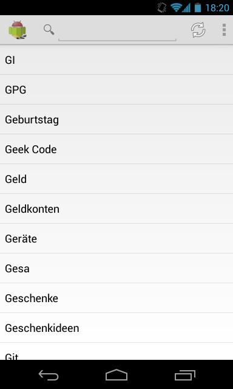
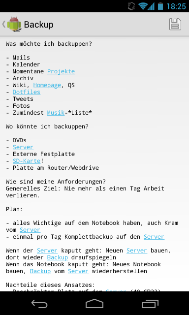

RoboBoy - a personal wiki for Android with Git synchronization
==============================================================

Always take your brain extension with you!

RoboBoy is a sister project of [Vimboy](https://github.com/blinry/vimboy),
and serves exactly the same purpose: Managing a personal wiki of interlinked
text files. It can synchronize with any Git server via Public Key Authentication.

 &nbsp; 

Installation
------------

Have a recent Android SDK, and `ant`. Clone this repo, connect your device, issue

    ant debug install

Setup
-----

Warning: This is still quite hacky. Enable developer access on your phone.

You need a Git repository that can be accessed via SSH key authentication. I recommend [gitolite](http://gitolite.com/gitolite/) for managing those on your own server. For testing purposes, a public GitHub repository works as well.

On your computer, generate a new SSH key pair with

    ssh-keygen -f phone -N ""

Passphrases are not supported yet. Give the new key read/write permission to your repository. Now, copy the key pair to your android device with

    adb push phone /sdcard/.ssh/phone
    adb push phone.pub /sdcard/.ssh/phone.pub

In RoboBoy's settings, specify the key's location, choose a name and email address for new commits, return to the main screen and sync away!

Usage
-----

On my main computer, I use this script to sync and merge with the `phone` branch:

    git add -A
    git commit -m "Sync"

    git fetch
    git merge origin/phone && git push

License
-------

RoboBoy is free software: you can redistribute it and/or modify it under the
terms of the GNU General Public License as published by the Free Software
Foundation, either version 3 of the License, or (at your option) any later
version.

RoboBoy is distributed in the hope that it will be useful, but WITHOUT ANY
WARRANTY; without even the implied warranty of MERCHANTABILITY or FITNESS FOR A
PARTICULAR PURPOSE. See the GNU General Public License for more details.

See LICENSE file for a copy of the GNU General Public License.

    Copyright (C) 2013  Sebastian Morr <sebastian@morr.cc>

Credits
-------

- Images
    - The RoboBoy logo is reproduced or modified from [work created and shared by Google](https://developer.android.com/distribute/googleplay/promote/brand.html) and used according to terms described in the Creative Commons 3.0 Attribution License.
- Libraries
    - [jGit](http://www.eclipse.org/jgit/), jGit contributors, Eclipse Distribution License - v 1.0
    - [JSch](http://www.jcraft.com/jsch/), Atsuhiko Yamanaka, Modified BSD License
    - [Android Support Library](https://developer.android.com/tools/extras/support-library.html), The Android Open source Project, Apache License, Version 2.0
